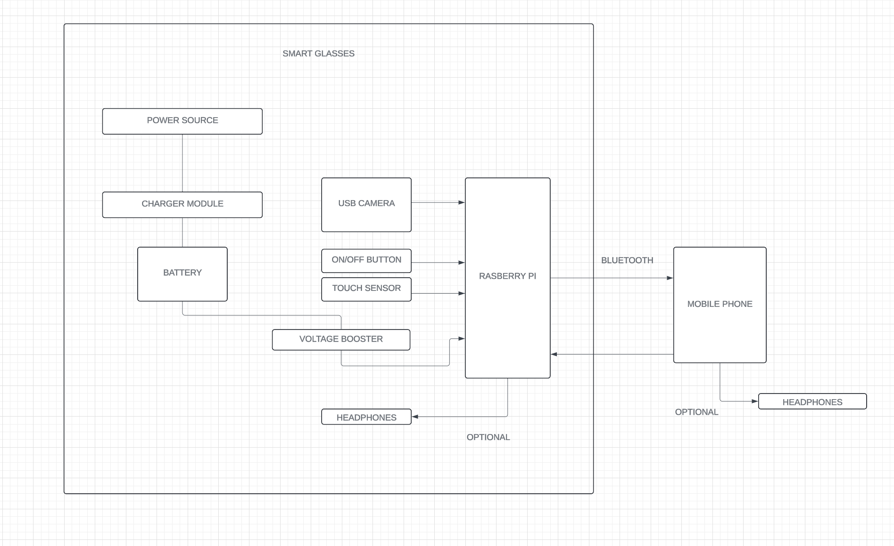

# Smart Glasses for Blind People

- A rapid prototyping project to develop smart glasses that use a camera to detect objects and provide audio feedback to user (people with low vision).


## Introduction

This project aims to create smart glasses that assist blind people by detecting objects within a few meters and providing real-time audio feedback. The system utilizes a camera, a Raspberry Pi for processing, and a mobile phone for advanced analysis.

## Features

- Real-time object detection
- Audio feedback via headphones
- Touch sensor for mode switching
- Wireless communication with a mobile phone for advanced processing
- Battery-powered with an hour and a half of operational time

## Hardware Components

- **Raspberry Pi**: Processing unit for transferring data from camera and sensors to mobile phone
- **USB Camera**: Razer Kiyo or similar
- **Touch Sensor**: TTP223 capacitive touch sensor
- **Battery**: 1200mAh LiPo Battery (appropriate capacity)
- **Charging Module**: TP4056
- **Voltage Booster**: PowerBoost 1000C or similar
- **Headphones**: Any compatible headphones
- **On/Off Button**: Omron B3F-1000 Series EVQ-P7 

## Software Components

- **Raspberry Pi OS**: Operating system for the Raspberry Pi
- **Python**: Main programming language for data processing
- **OpenCV**: For image processing and object detection
- **Mobile App**: Built with React Native/Flutter for data analysis and feedback
- **...**

## Schematic Diagram



## Installation

### Prerequisites

- Raspberry Pi with Raspberry Pi OS installed
- Python 3.x installed on Raspberry Pi
- OpenCV installed on Raspberry Pi
- ...


### Steps

1. **Clone the Repository**

   ```bash
   git clone https://github.com/your-username/Smart_Glasses.git
   cd Smart_Glasses


2. **Complie and Run read_data.cpp**

   ```bash
   cd Smart_Glasses/hw_sw_coding
   gcc read_data.cpp -o read_data
   ./read_data

3. **Run realtime_plot**

   ```bash
   cd Smart_Glasses/hw_sw_coding
   python3 realtime_plot.py


4. **Run test.py for simulating the process of realtime plot with random numbers**

   ```bash
   cd Smart_Glasses/hw_sw_coding
   sudo python3.py

5. **...**


